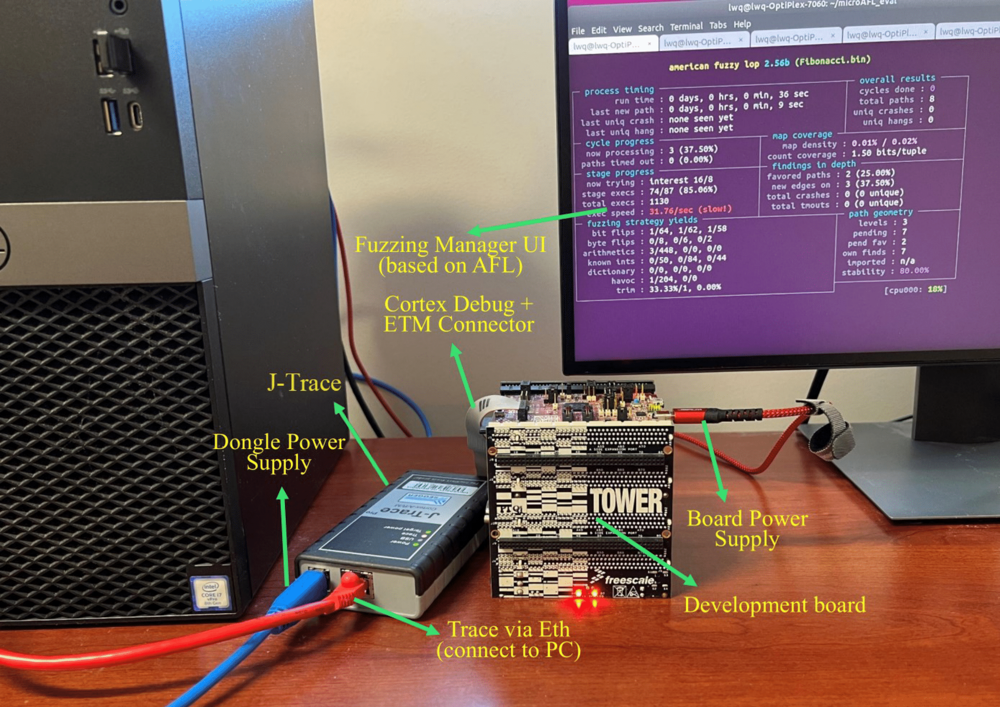

# 𝜇AFL: Non-intrusive Feedback-driven Fuzzing for Microcontroller Firmware

## Introduction
Fuzzing is one of the most effective approaches to finding software flaws. However, applying it to microcontroller firmware incurs many challenges. For example, rehosting-based solutions cannot accurately model peripheral behaviors and thus cannot be used to fuzz the corresponding driver code. In this work, we present 𝜇AFL, a hardware-in-the-loop approach to fuzzing microcontroller firmware. It leverages debugging tools in existing embedded system development to construct an AFL-compatible fuzzing framework. Specifically, we use the debug dongle to bridge the fuzzing environment on the PC and the target firmware on the microcontroller device. To collect code coverage information without costly code instrumentation, 𝜇AFL relies on the ARM ETM hardware debugging feature, which transparently collects the instruction trace and streams the results to the PC. However, the raw ETM data is obscure and needs enormous computing resources to recover the actual instruction flow. We therefore propose an alternative representation of code coverage, which retains the same path sensitivity as the original AFL algorithm, but can directly work on the raw ETM data without matching them with disassembled instructions. To further reduce the workload, we use the DWT hardware feature to selectively collect runtime information of interest. We evaluated
𝜇AFL on two real evaluation boards from two major vendors: NXP and STMicroelectronics. With our prototype, we discovered ten zero-day bugs in the driver code shipped with the SDK of STMicroelectronics and three zero-day bugs in the SDK of NXP. Eight CVEs have been allocated for them. Considering the wide adoption of vendor SDKs in real products, our results are alarming.

For more technical details, please refer to our [ICSE paper](https://arxiv.org/abs/2202.03013).

## Repo Structure
- ./ETMFuzz_Src: Source code of 𝜇AFL
- ./microAFL_eval: Firmware samples evaluated in our paper.
- ./init.sh: Script to prepare to fuzz including setting core affinity and preparing trace buffer for ETM trace.

## Environment
### Hardware Environment
- J-Trace Pro
  - You can purchase it from https://www.segger.com/products/debug-probes/j-trace/
- NXP TWR-K64F120M

### Software Environment
- Ubuntu 18/20 (tested)
- J-Link shared library
  - Download J-Link Software and Documentation pack zip file from https://www.segger.com/downloads/jlink/JLink_Linux_V758e_x86_64.tgz. V758e is the version we used during development. Use other versions at your own risk.
  - Unzip and extract libjlinkarm.so, libjlinkarm.so.7 and libjlinkarm.so.7.58.5 into the directory ./ETMFuzz_Src.
- J-Link Software and Documentation pack
  - Download and install J-Link Software and Documentation pack deb file from https://www.segger.com/downloads/jlink/JLink_Linux_V758e_x86_64.deb.

*Note: When there is a newer version of J-Link Software, make sure to update both the deb installation and the shared libraries. You can avoid extacting the shared libraries from the zip file by directly locating them from the deb installation. Unfortunately, the location is OS dependant.*

## Fuzzing
Preparing the hardware environment:
- Connect J-Trace Pro to TWR-K64F120M with the 20-pin ETM cable.
- Connect J-Trace Pro to PC with the USB cable.
- Power on J-Trace Pro and TWR-K64F120M.
- (Optional)  By default, J-Trace Pro uses the USB cable to communicate with the PC. You can also use Ethernet which provides better stability and performence. The is a [tutorial](https://wiki.segger.com/Setting_up_Ethernet_interface) for setting up the Ethernet connection. 




Run the following command each time the PC is rebooted.
```shell
./init.sh 
```

We use the I2C sample as an example to explain how to fuzz with 𝜇AFL.

- **Configure J-Trace Serial Number.** The user needs to change the macro `JLINK_SERIAL_NO` in the file `./ETMFuzz_Src/Samples_ETMFuzz_Src/device.h` to the unique serial number of the J-Trace Pro.
- **Choose a fuzzing sample.** The user needs to modify the macro `TARGET_PROJECT` in the file `./ETMFuzz_Src/Samples_ETMFuzz_Src/device.h`. Here we set it to 1.
- **Build.** To build 𝜇AFL, simply run the command `make` in the `./ETMFuzz_Src`directory.
- **Fuzz.** Run the script `./twrk64f120m_i2c_polling_b2b_transfer_master.sh` in the directory `microAFL_eval`. If a timeout error is observed, increase the time value via the `-t` option and try again.
